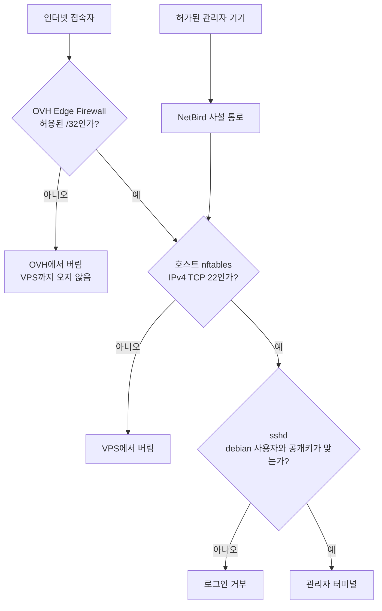
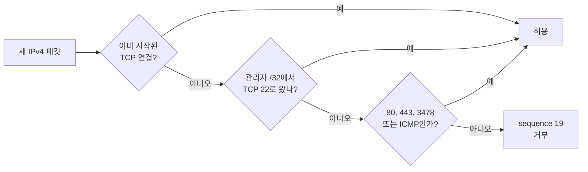
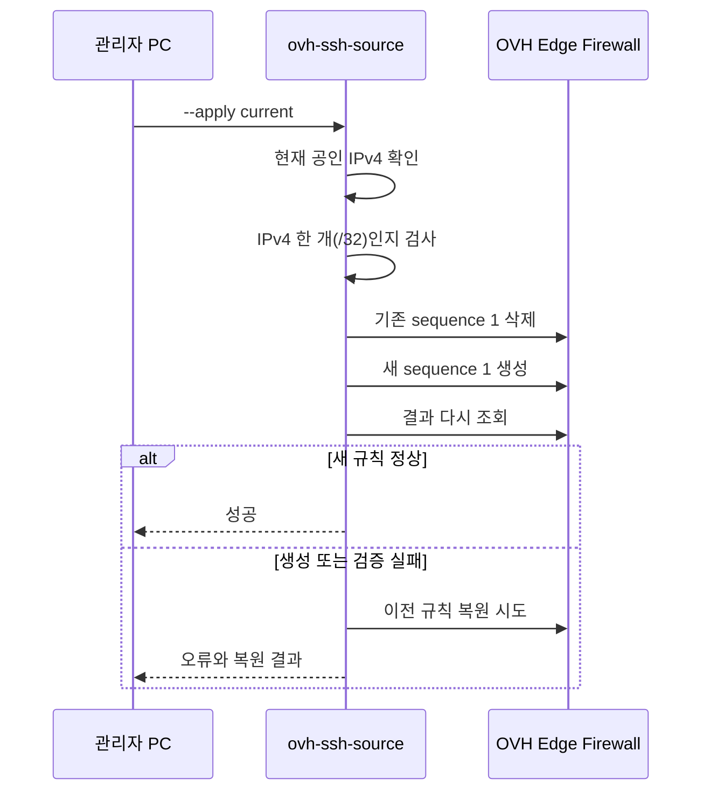
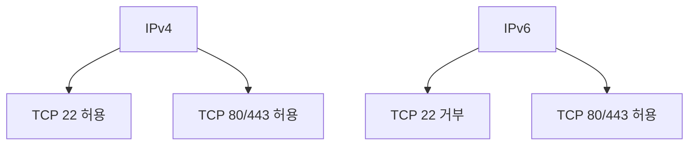
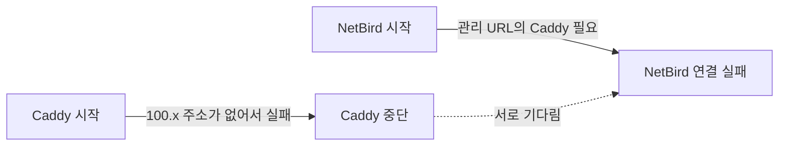
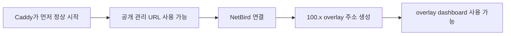
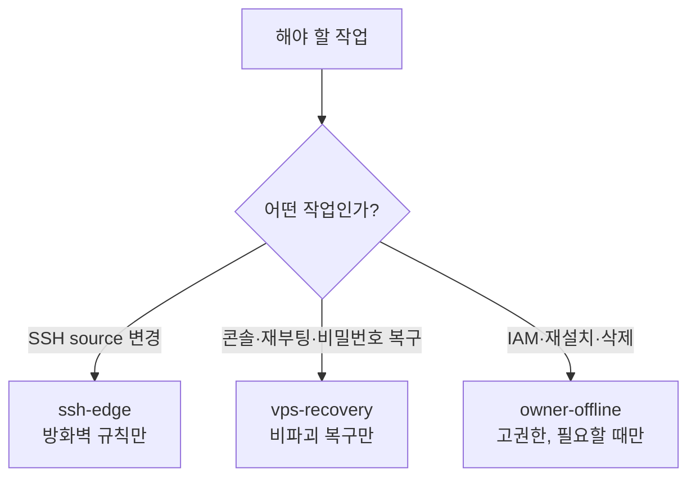
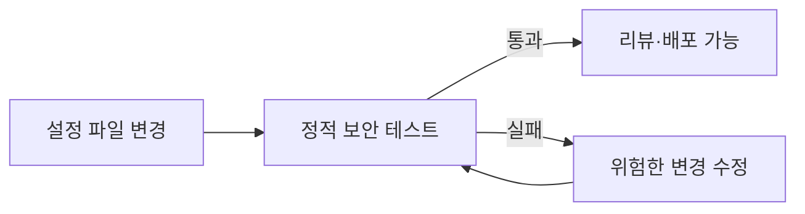

# OVH VPS SSH 보안, 처음부터 이해하기

작성일: 2026-08-21  
대상 서버: `vps.example.invalid` (`203.0.113.10`)

이 문서는 리눅스 보안을 처음 배우는 성인을 위한 학습 문서다. 명령을 외우기보다 **왜 여러 겹의 방어가 필요한지** 이해하는 것을 목표로 한다.

---

## 1. 우리가 해결하려는 문제

인터넷에 SSH 포트 22를 열면 자동 공격 봇이 계속 접속을 시도한다. 봇은 비밀번호를 추측하거나 오래된 SSH 약점을 찾는다. 이 서버는 비밀번호 로그인을 이미 막았지만, 공격 시도 자체가 Discord 경보와 로그를 시끄럽게 만들었다.

그렇다고 SSH를 완전히 닫을 수는 없다. NetBird가 고장 났을 때 서버를 복구할 마지막 통로가 필요하기 때문이다.

따라서 목표는 다음과 같다.

1. 공개 SSH 포트 22는 복구용으로 남긴다.
2. 집의 공인 IPv4 주소 **한 개**만 공개 SSH에 들어오게 한다.
3. NetBird 관리 통로는 별도로 유지한다.
4. 한 방어막이 실수로 사라져도 다음 방어막이 공격을 막게 한다.
5. 위험한 설정 변경은 네트워크 없이 실행하는 정적 테스트로 잡는다.

## 2. 먼저 알아둘 낱말

| 낱말 | 쉬운 뜻 |
|---|---|
| SSH | 다른 컴퓨터의 터미널에 안전하게 접속하는 방법 |
| TCP 22 | SSH가 기본으로 사용하는 인터넷 문 번호 |
| source | 접속을 시작한 쪽의 IP 주소 |
| `/32` | IPv4 주소 딱 한 개를 뜻하는 표기 |
| allowlist | 목록에 적힌 대상만 허용하는 방식 |
| firewall | 네트워크 연결을 허용하거나 버리는 문지기 |
| nftables | VPS 안에서 동작하는 리눅스 방화벽 |
| Edge Firewall | VPS에 도착하기 전 OVH 네트워크에서 동작하는 방화벽 |
| sshd | 서버에서 SSH 접속을 받는 프로그램 |
| NetBird | 허가된 기기끼리 만드는 사설 관리 네트워크 |
| IAM | 계정마다 할 수 있는 일을 제한하는 권한 시스템 |
| fail-closed | 작업이 실패하면 열어 두지 않고 닫힌 상태로 남는 성질 |
| 정적 테스트 | 실제 서버나 인터넷에 접속하지 않고 파일의 안전 규칙을 검사하는 테스트 |

## 3. 전체 그림: 건물의 여러 문

서버를 중요한 자료가 있는 건물이라고 생각해 보자.

- **OVH Edge Firewall**은 건물 단지 입구다.
- **호스트 nftables**는 건물 현관이다.
- **sshd**는 방의 열쇠 구멍이다.
- **SSH 공개키**는 복제하기 어려운 실제 열쇠다.
- **NetBird**는 직원만 쓰는 별도 통로다.
- **IAM 계정 분리**는 경비원마다 다른 열쇠 꾸러미를 주는 일이다.



중요한 원리는 **한 겹만 믿지 않는 것**이다. Edge 설정이 잘못되어도 nftables와 sshd가 남는다. NetBird가 멈춰도 허용된 `/32`에서 공개 SSH로 복구할 수 있다.

## 4. 누가 무엇을 책임지는가

| 방어 계층 | 책임 | 일부러 하지 않는 일 |
|---|---|---|
| OVH Edge Firewall | 외부 IPv4 중 관리자 `/32`만 SSH 허용 | IPv6와 서버 내부 트래픽 보호 |
| 호스트 nftables | 기본 거부, IPv6 SSH 차단, 필요한 포트만 허용 | 집 IP가 바뀔 때마다 `/32` 동기화 |
| sshd | root·비밀번호 로그인 금지, `debian` 공개키만 허용 | 네트워크 source 판별 |
| NetBird | 평상시 관리용 사설 경로와 ACL | 공개 SSH 복구 경로 대체 |
| CrowdSec | 애플리케이션 공격과 잘못된 설정의 추가 방어 | Edge Firewall 대체 |
| OVH IAM | 자동화 계정의 권한 최소화 | 모든 작업에 관리자 권한 제공 |

이렇게 책임을 나누면 설정을 이해하기 쉽고, 한 곳의 실수가 전체 장애로 번질 가능성이 줄어든다.

---

## 5. OVH Edge Firewall 원리

### 5.1 왜 `/32`인가

현재 집의 공인 IPv4는 `198.51.100.20`다.

```text
198.51.100.20/32
```

IPv4에서 `/32`는 주소 한 개만 뜻한다.

- `198.51.100.20/32`: 정확히 한 주소
- `211.245.140.0/24`: 최대 256개 주소
- `0.0.0.0/0`: 인터넷의 모든 IPv4 주소

SSH 복구 통로에는 한 주소만 필요하므로 `/32`보다 넓은 범위를 허용하지 않는다.

### 5.2 규칙은 위에서 아래로 읽는다

원하는 규칙의 원본은 `profiles/ovh-vps.security.json`이다.

| 순서 | 동작 | 의미 |
|---:|---|---|
| 0 | permit | 이미 시작된 TCP 연결의 응답 허용 |
| 1 | permit | 관리자 `/32`에서 오는 TCP 22 허용 |
| 2 | permit | 웹 HTTP, TCP 80 허용 |
| 3 | permit | 웹 HTTPS, TCP 443 허용 |
| 4 | permit | NetBird STUN, UDP 3478 허용 |
| 5 | permit | 네트워크 진단용 ICMP 허용 |
| 19 | deny | 위에 해당하지 않는 나머지 IPv4 거부 |



마지막 deny가 중요하다. 허용할 것을 먼저 적고, 나머지를 마지막에 모두 거부한다. 이것이 allowlist 방식이다.

### 5.3 source port를 적지 않는 이유

서버의 목적지 포트는 SSH이므로 22로 고정된다. 반면 접속하는 컴퓨터의 source port는 운영체제가 잠깐 골라 쓰는 임시 번호다. 매번 바뀌므로 source port를 제한하면 정상 SSH도 자주 실패한다.

---

## 6. 집 IP가 바뀌면 어떻게 하는가

`ovh-ssh-source` 명령은 SSH 허용 규칙을 여러 개 쌓지 않는다. sequence 1 하나를 새 `/32`로 **교체**한다.

```bash
# 변경 계획만 보기: 실제 변경 없음
ovh-ssh-source current

# 현재 외부 IPv4로 교체
ovh-ssh-source --apply current

# 원래 집 주소로 복원
ovh-ssh-source --apply home

# 직접 지정한 IPv4 한 개로 교체
ovh-ssh-source --apply set 203.0.113.10

# Edge에서 공개 SSH 완전히 닫기
ovh-ssh-source --apply close
```



기존 규칙을 지운 뒤 새 규칙을 만든다. 중간에 실패하면 전 세계에 열리는 대신 닫힌 상태가 된다. 이것이 fail-closed다.

서버 안에는 SSH를 잠깐 여는 JIT timer를 두지 않는다. 공개 source 변경은 서버가 아니라 OVH 관리면에서 한다. 그래야 NetBird와 서버가 모두 고장 난 상황에서도 복구할 수 있다.

---

## 7. 호스트 nftables가 여전히 필요한 이유

Edge Firewall은 OVH 바깥에서 들어오는 IPv4를 먼저 거른다. 하지만 다음 이유로 호스트 방화벽도 남겨야 한다.

1. Edge Firewall은 IPv6 SSH를 대신 막아 주지 않는다.
2. OVH 내부 경로나 설정 실수에 대비해야 한다.
3. 서버가 허용할 포트를 서버 자신도 알고 있어야 한다.

핵심 규칙은 다음과 같다.

```nft
meta nfproto ipv4 tcp dport 22 ct state new accept
tcp dport { 80, 443 } ct state new accept
meta nfproto ipv4 udp dport 3478 ct state new accept
```

뜻을 한 줄씩 풀면 다음과 같다.

- SSH 22: **IPv4만** 허용
- 웹 80/443: IPv4와 IPv6 모두 허용
- STUN 3478: **IPv4 UDP만** 허용

`inet` 테이블에서 단순히 `tcp dport 22 accept`라고 쓰면 IPv4와 IPv6가 모두 열릴 수 있다. 그래서 SSH 규칙 앞에 `meta nfproto ipv4`를 명시한다.



### 주의: 실행 중인 서버에서 `flush ruleset` 금지

Podman과 NetBird는 실행 중에 nftables 규칙을 추가한다. 이때 `nftables restart`나 `flush ruleset`을 실행하면 동적 규칙도 함께 사라질 수 있다.

실제 적용 과정에서도 이 때문에 NetBird 관리 경로가 잠시 끊겼다.

안전한 원칙은 다음과 같다.

1. 영구 파일은 먼저 `nft -c -f /etc/nftables.conf`로 문법만 검사한다.
2. 실행 중인 규칙은 필요한 handle만 원자적으로 교체한다.
3. 전체 영구 규칙 적용은 부팅 순서가 보장되는 재부팅에서 확인한다.

---

## 8. Caddy와 NetBird의 부팅 순환 문제

NetBird가 연결되면 VPS에 `100.x.x.x` overlay 주소가 생긴다. 과거 Caddy 설정은 이 주소에 직접 bind했다.

문제는 재부팅 직후에는 아직 그 주소가 없다는 점이다.



이것이 부팅 deadlock, 즉 서로 기다려 아무도 진행하지 못하는 상태다.

해결 방법은 Caddy가 `100.x` 주소에 직접 bind하지 않게 하는 것이다. 대신 listener를 공유하고 요청의 source가 NetBird 주소 범위인지 검사한다.

```caddy
@overlay remote_ip 100.64.0.0/10 fd00::/8
@notOverlay not remote_ip 100.64.0.0/10 fd00::/8
respond @notOverlay 403
```



이제 Caddy는 NetBird 주소가 생기기 전에도 시작할 수 있다. 외부에서 overlay용 Host를 흉내 내더라도 source 검사를 통과하지 못해 403을 받는다.

---

## 9. sshd는 마지막 자물쇠다

방화벽이 접속자를 줄여도 sshd 자체를 약하게 두면 안 된다.

```text
PermitRootLogin no
PasswordAuthentication no
KbdInteractiveAuthentication no
PubkeyAuthentication yes
AllowUsers debian
DisableForwarding yes
```

쉬운 뜻은 다음과 같다.

- root로 바로 로그인하지 않는다.
- 비밀번호 로그인을 받지 않는다.
- 공개키가 있는 `debian` 사용자만 로그인한다.
- SSH를 임의의 네트워크 터널로 사용하지 못하게 한다.

Edge Firewall이 실수로 넓게 열려도 공격자는 여전히 올바른 개인키가 필요하다.

## 10. 자격증명을 세 꾸러미로 나누는 이유

모든 자동화에 관리자 열쇠를 주면 작은 스크립트 실수도 서버 재설치나 삭제로 이어질 수 있다. 그래서 필요한 권한만 가진 계정을 따로 만든다.



### `ssh-edge`

Edge Firewall 조회와 규칙 변경만 할 수 있는 OAuth2 계정이다. 자격증명은 저장소 밖의 다음 파일에 둔다.

```text
~/.config/ovhcloud/ssh-edge.env
```

파일 권한은 소유자만 읽고 쓸 수 있는 `0600`이다.

### `vps-recovery`

VPS 조회, KVM 콘솔, 재부팅, 비밀번호 복구 같은 비파괴 작업만 할 수 있다. reinstall, terminate, snapshot restore 권한은 주지 않는다.

### `owner-offline`

IAM 변경, 재설치, 삭제처럼 위험한 작업에만 쓰는 고권한 profile이다. 평상시 기본 profile에는 이 권한을 두지 않는다.

```text
작은 열쇠를 잃으면 작은 문만 위험하다.
만능 열쇠 하나를 잃으면 건물 전체가 위험하다.
```

비밀값과 KVM URL은 Git 저장소, 명령 인자, Discord, 디버그 로그에 출력하지 않는다.

---

## 11. 자동 검증: 네트워크 없는 정적 테스트

보안 설정은 사람이 문서를 읽는 것만으로 지키기 어렵다. 나중에 누군가 한 줄을 바꿔 IPv6 SSH를 열 수도 있다. 그래서 중요한 결정을 코드로 검사한다.

실행 명령은 하나다.

```bash
python3 -m unittest -v test_ovh_security_static.py
```

이 테스트는 OVH나 VPS에 접속하지 않는다. 따라서 인터넷이 없어도 빠르게 실행된다.

| 정적 테스트가 검사하는 것 | 잡아내는 실수 예시 |
|---|---|
| SSH allowlist가 정확히 한 개의 IPv4 `/32`인지 | `/24`, `0.0.0.0/0`, 여러 SSH permit 추가 |
| Edge 규칙 순서와 마지막 deny | deny 삭제, 포트 순서 변경 |
| source port가 없는지 | 임시 source port를 고정해 정상 접속 차단 |
| 호스트 SSH가 IPv4 전용인지 | `tcp dport 22`로 IPv6까지 개방 |
| 웹 80/443은 dual-stack인지 | 웹 IPv6를 실수로 차단 |
| input 기본 policy가 drop인지 | 기본 허용으로 변경 |
| `wt0` 전체를 신뢰하지 않는지 | NetBird ACL 우회 |
| Caddy가 overlay IP에 bind하지 않는지 | 재부팅 deadlock 재발 |
| overlay source 검사와 403이 있는지 | 공개망에서 dashboard 우회 |
| 위험 작업이 `owner-offline`을 쓰는지 | 기본 profile로 재설치 수행 |
| 비밀 파일이 저장소 밖을 가리키는지 | 저장소에 client secret 저장 |
| 공개 명령이 `cmd-links` 관리 대상인지 | 관리되지 않는 임의 symlink 생성 |
| 서버 측 SSH JIT가 다시 생기지 않았는지 | 두 관리면을 동기화해야 하는 복잡성 재도입 |



### 정적 테스트가 증명하지 못하는 것

정적 테스트는 **설계도**가 안전한지 검사한다. 실제 OVH에 그 설계도가 적용됐는지, 현재 네트워크가 연결되는지는 증명하지 못한다.

이를 집에 비유하면 다음과 같다.

- 정적 테스트: 도면에 현관문과 자물쇠가 있는지 검사
- 실제 연결 시험: 완성된 집의 문이 정말 잠기는지 검사

실제 연결 시험은 최초 적용, 방화벽 변경, 재부팅 같은 운영 시점에 수행한다. 매번 실행하는 회귀 검증은 정적 테스트로 고정한다.

## 12. 장애가 났을 때 생각하는 순서

### 허용된 집에서도 공개 SSH가 안 될 때

1. 현재 공인 IPv4가 바뀌었는지 확인한다.
2. `ovh-ssh-source current`로 변경 계획을 본다.
3. 필요하면 `ovh-ssh-source --apply current`를 실행한다.
4. 그래도 안 되면 OVH KVM 복구 경로를 사용한다.

### NetBird가 안 될 때

1. 공개 HTTPS 관리 URL이 응답하는지 확인한다.
2. Caddy가 overlay IP에 직접 bind하도록 되돌아가지 않았는지 확인한다.
3. `nftables restart`나 `flush ruleset`을 실행하지 않는다.
4. 허용된 `/32`의 공개 SSH로 들어가 NetBird와 Caddy 상태를 확인한다.

### 공개 SSH를 잘못 닫았을 때

NetBird가 살아 있으면 NetBird SSH로 복구한다. NetBird도 죽었다면 OVH KVM을 사용한다.

```bash
ovhcloud --profile owner-offline vps get-console-url vps.example.invalid
ovhcloud --profile owner-offline vps set-password vps.example.invalid --wait
ovhcloud --profile owner-offline vps reboot vps.example.invalid --wait
```

복구 명령은 위험도가 높다. 출력에 자격증명이나 KVM URL을 남기지 않는다.

---

## 13. 실제 적용 때 확인한 결과

2026-08-21에 적용하고 재부팅한 뒤 다음을 확인했다.

- Edge Firewall 활성 및 모든 규칙 상태 정상
- 허용된 `198.51.100.20/32`에서 공개키 SSH 성공
- 서로 다른 Tor exit에서 VPS TCP 22 연결 실패
- 같은 Tor 세션의 `github.com:22`와 VPS TCP 443 양성 대조군은 성공
- 분산 TCP 검사 대부분에서 포트 22 timeout
- sshd journal에 허용 source 외 접속 도달 기록 없음
- IPv6 공개 SSH host rule 없음
- 일반 NetBird SSH와 NetBird embedded SSH 성공
- OIDC, gRPC, STUN, overlay dashboard 검증 성공
- 재부팅 후 Caddy와 NetBird 모두 정상 시작

한 분산 검사 노드는 닫힌 2222와 65000 포트까지 open이라고 보고했다. 같은 검사기가 명백히 닫힌 포트도 open이라고 했으므로 오탐으로 판단했다. 보안 검증에는 항상 양성·음성 대조군을 함께 두어야 한다.

## 14. 핵심만 다시 보기

```text
1. 공개 SSH는 복구용으로 남긴다.
2. OVH Edge Firewall은 관리자 IPv4 한 개(/32)만 TCP 22에 허용한다.
3. 호스트는 IPv6 SSH와 나머지 불필요한 입력을 막는다.
4. sshd는 debian + 공개키만 받는다.
5. NetBird는 평상시 쓰는 별도 관리 통로다.
6. Caddy는 아직 없는 overlay IP에 직접 bind하지 않는다.
7. 자동화 계정은 필요한 권한만 가진다.
8. 중요한 설계 결정은 정적 테스트로 고정한다.
```

## 참고 문서

- [OVHcloud Edge Network Firewall](https://help.ovhcloud.com/csm/en-dedicated-servers-firewall-network?id=kb_article_view&sysparm_article=KB0043448)
- [OVHcloud service accounts](https://help.ovhcloud.com/csm/en-manage-service-account?id=kb_article_view&sysparm_article=KB0059343)
- [OVHcloud VPS KVM](https://help.ovhcloud.com/csm/en-vps-use-kvm?id=kb_article_view&sysparm_article=KB0047779)
- [OVHcloud VPS rescue mode](https://help.ovhcloud.com/csm/en-vps-rescue?id=kb_article_view&sysparm_article=KB0047756)
- [ovhcloud CLI](https://github.com/ovh/ovhcloud-cli)
