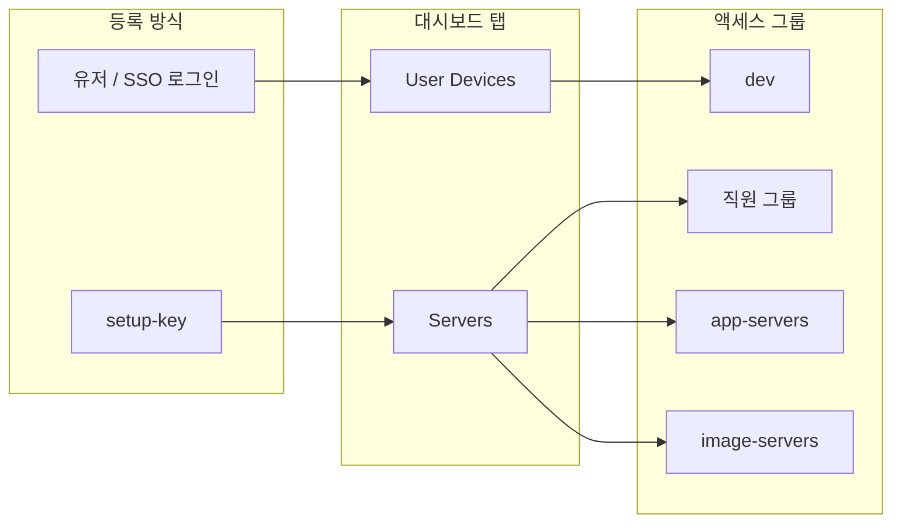

# setup-key 직원 PC가 GUI Servers 탭에 보이는 이유

작성일: 2026-08-21  
대상: self-hosted NetBird. 직원 Windows PC를 one-off setup-key로 등록한 뒤, 대시보드 Peers가 `User Devices` / `Servers`로 나뉜 구성.

이 문서는 **대시보드 탭 이름과 액세스 그룹을 혼동하지 않기 위한** 판정 기록이다. 운영 호스트명·오버레이 IP·관리 URL·메일·키 값은 넣지 않는다.

---

## 1. 질문

최근 setup-key로 붙인 것은 직원 Windows PC다. GUI `Servers` 탭에 들어가고, `User Devices`에는 관리자 로컬 PC 하나만 있다. 직원 PC의 분류가 Server인 것이 맞는가.

## 2. 결론

**액세스 역할로는 틀리고, GUI 동작으로는 맞다.**

| 구분 | 직원 PC에 대한 판정 |
|---|---|
| 액세스 그룹 | 직원 그룹이 맞다. `app-servers`가 아니다. |
| 대시보드 `Servers` 탭 | setup-key라 소유자 유저가 없어서 헤드리스로 보이는 것이다. 서버 역할이 아니다. |
| 직원 PC를 `app-servers`에 넣는 것 | 틀린 판정이다. SSH·22·대시보드 정책까지 열린다. |

대시보드 부제 그대로다: *User devices and headless machines, such as servers and autonomous agents*.

탭 `Servers` ≠ 그룹 `app-servers`.

---

## 3. 두 분류기를 섞지 말 것

NetBird는 피어를 두 축으로 나눈다. 대시보드 탭은 등록 방식이고, 정책은 그룹이다.

### 3.1 대시보드 탭 = 소유자 유저 유무

| 탭 | 기준 | 이 네트워크에서 해당 |
|---|---|---|
| **User Devices** | IdP/유저 로그인. `user_id` 있음. 소유자 메일 표시 | 관리자 워크스테이션 (`dev`) |
| **Servers** | setup-key. `user_id` 없음. 헤드리스 | 직원 Windows PC (직원 그룹), 이미지 호스트 (`image-servers`), 앱 서버 (`app-servers`) |

관리 API로 확인하면 탭과 `user_id`가 일치한다. setup-key 피어는 사후에 유저를 붙이는 UI가 없다.

### 3.2 액세스 그룹 = 역할

직원 키의 auto-group은 직원 그룹이다. 서버용 `host-join`만 `app-servers`이고, 그 키는 미사용·revoked였다.

관측 시점의 역할 매핑:

| 역할 | 그룹 | 등록 |
|---|---|---|
| 관리자 PC | `dev` | 유저 로그인 |
| 직원 Windows PC | 직원 그룹 | one-off setup-key |
| 앱 서버 | `app-servers` | setup-key / 호스트 리콘실 |
| 이미지 호스트 | `image-servers` | setup-key (유저 없음) |

직원 PC의 그룹 칩은 직원 그룹이다. `app-servers`가 아니다.

---

## 4. 관측 (2026-08-21)

소스: 관리 API `GET /api/peers`, `/api/groups`, `/api/setup-keys`, `/api/policies`. 관리자 PC의 `netbird status`는 직원 피어를 보여 주지 않는다. Default `All -> All`이 꺼져 있고 `dev` → 직원 그룹 정책이 없기 때문이다. 클라이언트 CLI만 보면 잘못 판정하기 쉽다.

직원 Windows PC:

- OS: Windows 10, 클라이언트 0.76.3
- 그룹: `All` + 직원 그룹
- `user_id`: 없음
- SSH: 꺼짐
- 로그인 만료: 꺼짐
- 등록 시각과 직원용 one-off 키 `last_used`가 초 단위로 같음
- 해당 키: type one-off, usage 1/1, state overused
- 로컬 키 파일에서 그 줄만 주석 처리됨

정책 (관련만):

| 정책 | enabled | 내용 |
|---|---|---|
| Default / All → All | 꺼짐 | 풀메시 없음 |
| 직원 그룹 → `app-servers` | 켜짐 | TCP `3000`만 |
| `dev` → `app-servers` | 켜짐 | NetBird SSH, TCP 22, 80/443 |
| `app-servers` → `image-servers` | 켜짐 | TCP `8787` |
| `dev` → All | 꺼짐 | 관리자 전체 개방 아님 |

직원 PC를 `app-servers`에 넣으면 관리자 SSH/22/대시보드 규칙의 목적지가 된다. 지금은 그 반대다.

관리자 워크스테이션 `netbird status`의 피어 수 1/1은 ACL 때문이다. 직원 PC가 오프라인이라는 뜻이 아니다.

---

## 5. 왜 SSO 로그인을 권하는가

setup-key는 **기계를** 네트워크에 붙인다. SSO는 **누구의 기기인지**를 붙인다. 직원 PC는 후자가 맞다.

NetBird 문서 (`Bootstrap peers via config file`): setup-key는 서버·컨테이너·오토스케일·IaC 같은 **무인 워크로드**용이다. **엔드유저 기기에는 쓰지 마라.** Zero Trust는 피어 뒤의 사용자를 다시 확인해야 하는데, setup-key 피어에는 유저 신원이 없어서 세션 만료 후 재인증도, 유저 기준 정책도 할 수 없다.

같은 문서 계열의 그룹 가이드:

- **유저 그룹**은 계정에 붙고, 그 사람이 SSO로 로그인하는 PC·폰이 상속한다.
- **피어 그룹**은 서버처럼 사람이 로그인하지 않는 인프라에, setup-key auto-group 또는 수동으로 붙인다.
- 권장 정책 방향은 유저 그룹 → 인프라 그룹이다.

setup-key 직원 PC가 잃는 것:

1. **재인증.** 담당자가 바뀌거나 세션이 끝나도 피어는 연결된 기계로 남는다.
2. **사람 단위 권한.** 같은 사람이 기기를 추가하면 키를 또 만들어야 한다. 퇴사 시 유저 비활성만으로는 이 PC가 안 끊긴다. 피어를 직접 지운다.
3. **키보드 앞의 사람.** one-off여도 USB에 남은 미사용 키는 신원을 증명하지 않고 직원 그룹으로 들어간다.
4. **사후 소유자.** setup-key 피어에 유저를 나중에 붙일 수 없다. 그래서 GUI가 Servers로 둔다.

| | setup-key (현재 직원 PC) | SSO |
|---|---|---|
| 주체 | 그 Windows 한 대 | 그 사람 |
| 새 PC/폰 | 키 재발급 | 같은 계정 로그인 → 그룹 상속 |
| 회수 | 피어 삭제 | 유저 비활성 / IdP 그룹 해제 |
| 대시보드 | Servers | User Devices |
| 로그인 만료 | 해당 없음 | 세션 만료 후 재로그인 가능 |

관리자 PC가 `User Devices`인 이유: 유저 로그인으로 붙어서 소유자가 보인다.

---

## 6. 그래도 키를 쓰는 경우

`netbird-setup` USB one-off는 **IdP 없이 Windows를 붙이는 운영 타협**이다.

- 설치는 쉽고, auto-group으로 직원 그룹에 들어간다.
- 앱 포트 제한(`직원 그룹` → `app-servers:3000`)은 기계 그룹만으로 유지된다.
- 포기하는 것은 신원·회수·재인증이다.
- GUI `Servers`는 그 타협의 결과이지, 서버로 분류된 것이 아니다.

직원 PC를 사람 단위로 관리할 거면 SSO가 맞다. “이 자리의 이 PC만 앱 3000”이면 키로도 정책은 유지된다.

SSO로 바꾸려면 그 Windows에서 유저 로그인을 해야 한다. 키로 이미 붙은 피어는 탭이 바뀌지 않는다.

---

## 7. 남은 리스크

- 대시보드 `Servers`를 `app-servers`로 읽으면 직원 PC를 서버 그룹에 넣을 수 있다.
- 관리자 CLI에 직원 피어가 안 보이면 “등록 실패”로 오인하기 쉽다. 관리 API를 본다.
- 직원 피어 `accessible_peers_count`가 0으로 나올 수 있다. 정책상 TCP 3000은 별개로 확인한다.
- 미사용 직원 키가 USB에 남아 있으면, 그 키를 쓰는 기계가 곧 직원 역할이 된다.
- Default All → All을 다시 켜면 탭 분류와 상관없이 풀메시가 된다.

---

## 8. 참고

- [Register machines using setup keys](https://docs.netbird.io/manage/peers/register-machines-using-setup-keys)
- [Bootstrap peers via config file](https://docs.netbird.io/manage/peers/bootstrap-via-config-file) — 엔드유저 기기에 setup-key를 쓰지 말 것
- [Understanding Groups and Access Policies](https://docs.netbird.io/manage/access-control) — 유저 그룹 vs 피어 그룹
- [netbirdio/netbird#4863](https://github.com/netbirdio/netbird/issues/4863) — setup-key 피어에 유저 사후 할당 없음
- 이 저장소: `netbird-setup.py` (직원 one-off 키 + auto-group), `host-reconcile.py` (호스트는 `app-servers`)
